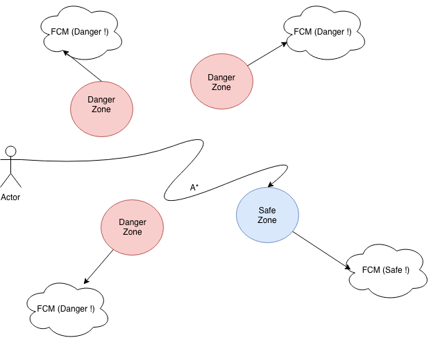

# Pengaplikasian Geofences sebagai realtime safe spot disaster information dengan metode A*

## Pejelasan Singkat
Aplikasi ini memanfaatkan api google geofences untuk memberi pagar atau batas di daerah yang tidak aman (danger zone) untuk masyarakat yang ingin mengungsi dari lokasi bencana. Jadi pengguna akan diberi notifikasi menggunakan FCM (firebase Cloud Messaging) apabila pengguna mendekati daerah yang sudah dibatasi atau diidentifikasi sebagai daerah yang berbahaya (danger zone). Dan juga dari aplikasi terdapat suggestion jarak terdekat dari lokasi pengguna ke daerah aman (safe zone) menggunakan metode A* (A star).

## Gambaran Sederhana

